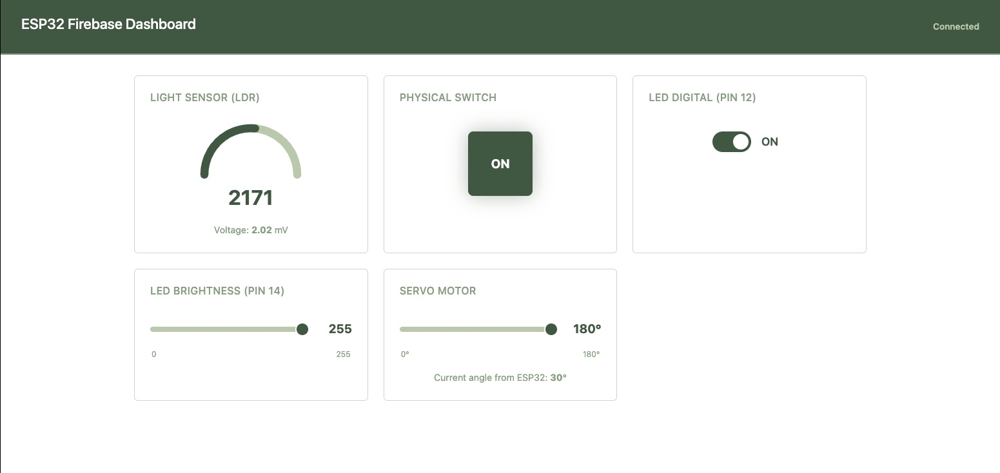
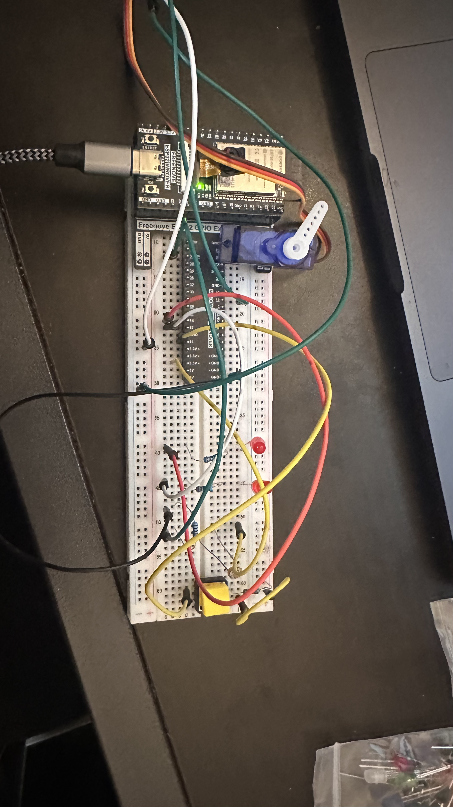

# ESP32 Firebase Realtime Dashboard

A real-time IoT dashboard that connects an ESP32 microcontroller to a web interface through Firebase Realtime Database. Monitor sensors and control actuators from your browser — changes sync instantly in both directions.

## Dashboard



## Circuit



## Features

- **LDR Light Sensor** — reads analog light level (0–4095) and voltage, displayed as an animated gauge
- **Physical Switch** — monitors a hardware button (Pin 13) with real-time ON/OFF indicator
- **Digital LED Control** — toggle an LED (Pin 12) on/off from the dashboard
- **PWM LED Brightness** — adjust LED brightness (Pin 14) with a 0–255 slider
- **Servo Motor** — control servo angle (0°–180°) from the dashboard; ESP32 also runs an auto-sweep

## Firebase RTDB Structure

```
├── Sensor/
│   ├── ldr_data    (int)     ← ESP32 writes
│   ├── voltage     (float)   ← ESP32 writes
│   └── switch      (bool)    ← ESP32 writes
├── LED/
│   ├── digital     (bool)    ← Dashboard writes, ESP32 reads
│   └── analog      (int)     ← Dashboard writes, ESP32 reads
└── Servo/
    └── angle       (int)     ← Both read/write
```

## Tech Stack

| Layer     | Technology                          |
|-----------|-------------------------------------|
| Hardware  | ESP32, LDR, LEDs, Servo, Push button |
| Firmware  | Arduino (WiFi, Firebase_ESP_Client, ESP32Servo) |
| Backend   | Firebase Realtime Database          |
| Frontend  | HTML/CSS/JS, Firebase JS SDK 10     |
| Server    | Node.js + Express (static hosting)  |
| Styling   | Bootstrap 5, custom CSS             |

## Getting Started

### Prerequisites

- Node.js
- Arduino IDE with ESP32 board support
- A Firebase project with Realtime Database enabled

### Web Dashboard

```bash
npm install
npm start
```

The dashboard runs at `http://localhost:3000`.

### ESP32 Firmware

1. Open `arduino/realtimeDB.txt` in Arduino IDE
2. Install the required libraries: **Firebase ESP Client**, **ESP32Servo**
3. Update the WiFi credentials and Firebase config in the sketch
4. Upload to your ESP32

### Firebase Setup

1. Create a Firebase project at [console.firebase.google.com](https://console.firebase.google.com)
2. Enable Realtime Database
3. Copy your API key and database URL into both:
   - `arduino/realtimeDB.txt` (ESP32 firmware)
   - `public/app.js` (web dashboard)

## Pin Configuration

| Component      | ESP32 Pin |
|----------------|-----------|
| LED (PWM)      | GPIO 14   |
| LED (Digital)  | GPIO 12   |
| LDR Sensor     | GPIO 36   |
| Servo Motor    | GPIO 18   |
| Push Button    | GPIO 13   |
