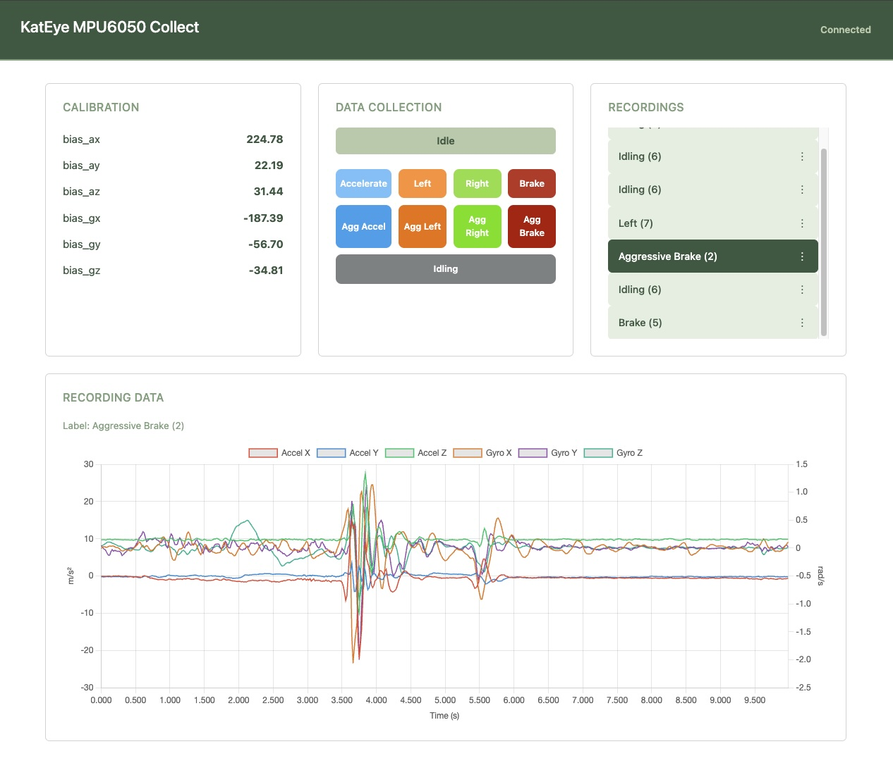
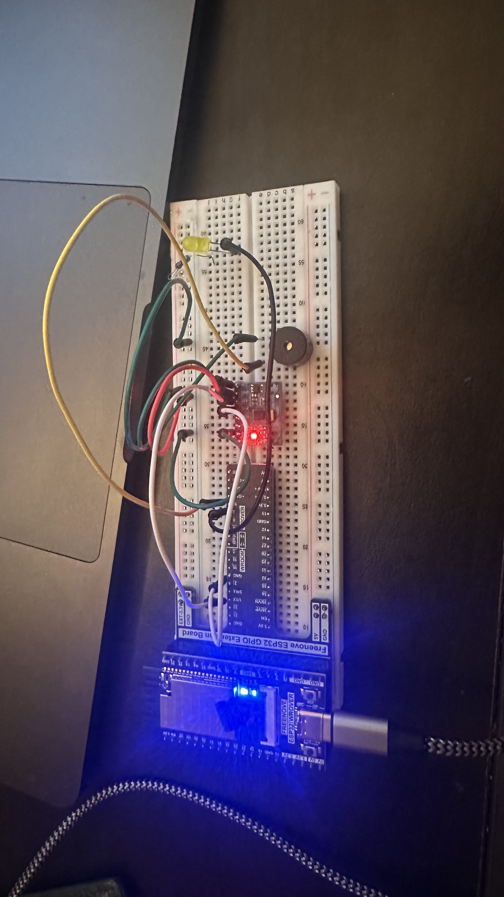

# KatEye MPU6050 Collect

A labeled IMU data collection tool for driving attitude classification. An ESP32 + MPU6050 records 10-second sessions of 6-axis accelerometer/gyroscope data, triggered from a web dashboard. Recordings are stored in Firestore and visualized with Chart.js for building a driving events CNN dataset.

## Dashboard



## Hardware




## Data Architecture

### Firebase Realtime Database (device commands/status)

```
datacollect/devices/kateye-collector-01/
├── command/
│   ├── trigger       (bool)     Dashboard writes
│   ├── label         (int)      Dashboard writes
│   └── label_name    (string)   Dashboard writes
├── status            (string)   ESP32 writes (idle/countdown/recording/uploading/done/error)
├── countdown_remaining (int)    ESP32 writes
├── progress          (int)      ESP32 writes (0–560)
├── last_error        (string)   ESP32 writes
└── last_recording_id (string)   ESP32 writes
```

### Firestore (recording storage)

Each document in the `recordings` collection:

```
recordings/{docId}
├── label           (int)       — class index (0–8)
├── label_name      (string)    — e.g. "Accelerate", "Aggressive Left"
├── sample_rate_hz  (number)    — 56
├── num_samples     (number)    — 560
├── calibration/
│   ├── bias_ax, bias_ay, bias_az
│   └── bias_gx, bias_gy, bias_gz
└── data/
    ├── accel_x[]   (float array, m/s²)
    ├── accel_y[]
    ├── accel_z[]
    ├── gyro_x[]    (float array, rad/s)
    ├── gyro_y[]
    └── gyro_z[]
```

## Tech Stack

| Layer     | Technology                                      |
|-----------|-------------------------------------------------|
| Hardware  | ESP32 + MPU6050 6-axis IMU                      |
| Firmware  | Arduino (WiFi, HTTPClient, ArduinoJson, I2Cdev) |
| Database  | Firebase Realtime Database + Firestore           |
| Backend   | Node.js + Express (Firestore REST API proxy)     |
| Frontend  | ES modules, Firebase JS SDK 10, Chart.js         |
| Styling   | Bootstrap 5, custom CSS                          |

## Getting Started

### Prerequisites

- Node.js
- Arduino IDE with ESP32 board support
- A Firebase project with **Realtime Database** and **Firestore** enabled

### Environment

Copy `.env.template` to `.env` and fill in your Firebase credentials:

```bash
cp .env.template .env
```

```
FIREBASE_API_KEY=your-api-key
AUTH_DOMAIN=your-project.firebaseapp.com
DATABASE_URL=https://your-project-default-rtdb.firebaseio.com
PROJECT_ID=your-project-id
STORAGE_BUCKET=your-project.appspot.com
MESSAGE_SENDER_ID=123456789
APP_ID=1:123456789:web:abc123
PORT=3000
```

### Run the Dashboard

```bash
npm install
npm start
```

The dashboard runs at `http://localhost:3000`.

### Upload Firmware

1. Open `arduino/data_collect_kateye.ino` in Arduino IDE
2. Install required libraries: **ArduinoJson**, **I2Cdev**, **MPU6050**
3. Edit `arduino/data_collector_config.h` with your WiFi credentials and Firebase config
4. Upload to your ESP32

## Arduino Firmware

- **`arduino/data_collect_kateye.ino`** — main firmware: state machine (IDLE → COUNTDOWN → RECORDING → UPLOADING → IDLE), MPU6050 calibration, hardware-timer-driven sampling at 56 Hz, Firestore upload via REST API
- **`arduino/data_collector_config.h`** — WiFi credentials, Firebase keys, sampling parameters (rate, duration, channels), pin assignments, mounting orientation

## API Endpoints

| Method   | Route                      | Description                                    |
|----------|----------------------------|------------------------------------------------|
| `GET`    | `/api/config`              | Returns Firebase config from server environment |
| `GET`    | `/api/recordings`          | Lists all recordings (id, label, label_name)    |
| `GET`    | `/api/recordings/:docId`   | Returns full recording data (samples, calibration) |
| `DELETE` | `/api/recordings/:docId`   | Deletes a recording from Firestore              |
